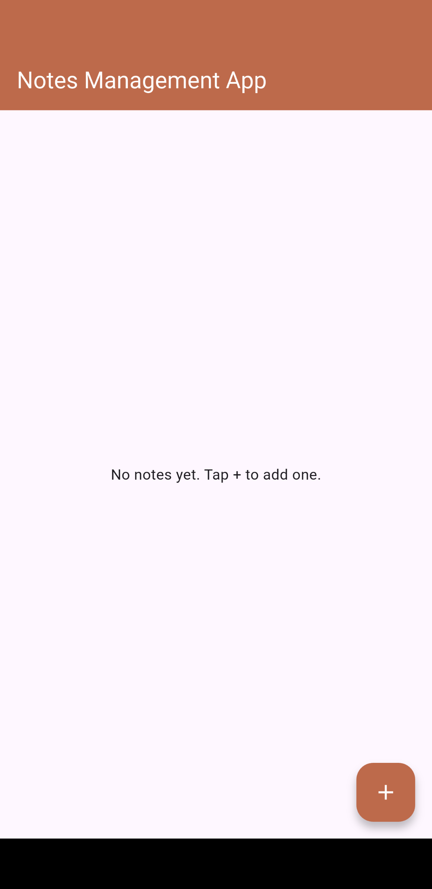
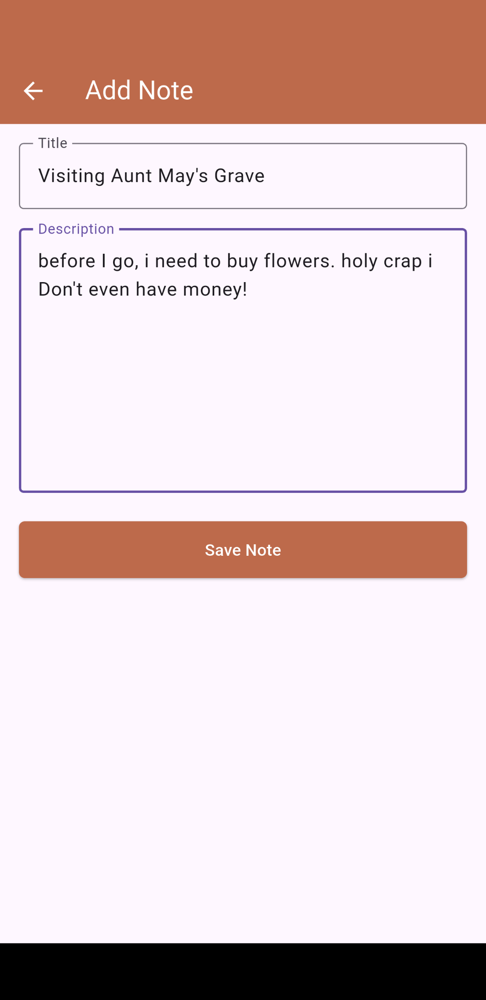
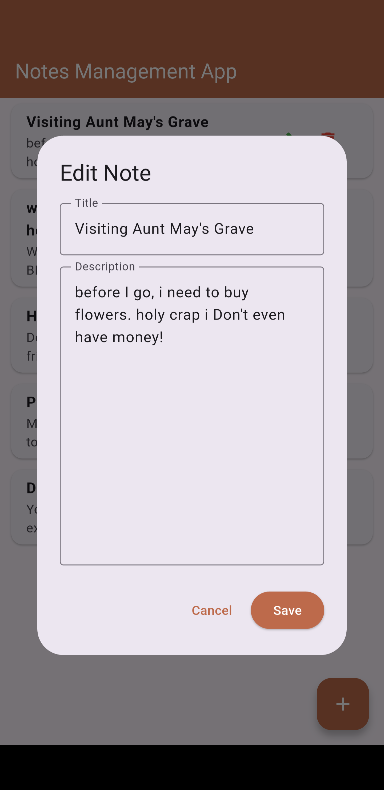
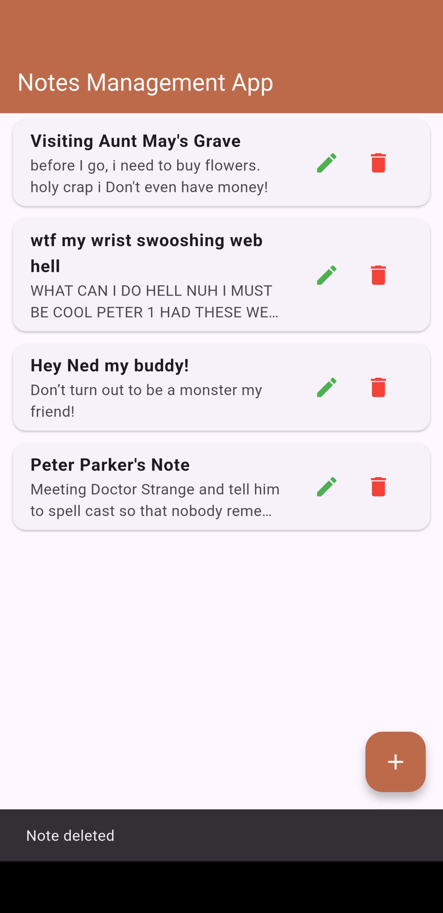

# 📝 Notes Management App

A Flutter application that demonstrates **CRUD (Create, Read, Update, Delete)** operations using **Firebase Cloud Firestore**.

This project was developed to understand how Flutter applications interact with Firebase and how Firestore can be used for real-time cloud data storage.

---

## ✨ Features

- ➕ Create new notes
- 📖 View all saved notes
- ✏️ Edit existing notes
- 🗑️ Delete notes
- ☁️ Real-time synchronization with Firebase Firestore
- 📱 Simple and user-friendly interface

---

## 🛠️ Built With

- Flutter
- Dart
- Firebase
- Cloud Firestore

---

## 📂 Project Structure

```
lib/
│
├── models/
│   └── note.dart
│
├── screens/
│   ├── addnote.dart
│   └── notelist.dart
│
├── services/
│   └── firestore_services.dart
│
└── main.dart
```

---

## 🔥 Firebase Integration

The application uses **Cloud Firestore** to store notes.

Each note contains:

- Title
- Description

Firestore automatically generates a unique document ID for every note.

---

## 📸 Screenshots

### Home Screen



---

### Add Note



---

### Edit Note



---

### Notes List



---

## 🚀 How to Run

1. Clone the repository

```bash
git clone https://github.com/your-username/notes_management_app.git
```

2. Install dependencies

```bash
flutter pub get
```

3. Configure Firebase

```bash
flutterfire configure
```

4. Run the application

```bash
flutter run
```

---

## 📚 Learning Objectives

This project demonstrates:

- Flutter UI development
- Firebase integration
- Cloud Firestore
- CRUD operations
- Real-time data updates using StreamBuilder
- Navigation between screens

---

## 👨‍💻 Author

**Zarin Tasnim Elahi**
